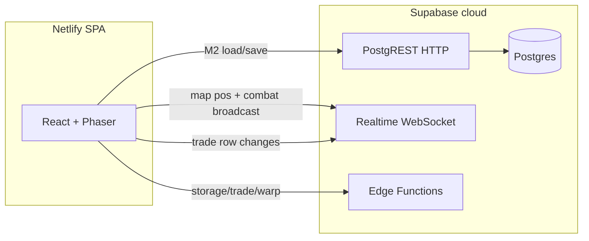

# Persistence vs realtime (Netlify + Supabase)

How character save/load (M2) relates to live multiplayer features, and why you do not host a separate WebSocket server on Netlify for this project.

## Does M2 use a socket?

**No.** [M2 — Persist core](MILESTONES.md) uses **HTTP request/response to Postgres** through the Supabase JS client:

- **Load:** [`client/src/lib/characterProgress.ts`](../client/src/lib/characterProgress.ts) — `loadCharacterSession()` runs parallel `.select()` on `character_progress`, `character_skills`, and `character_equipment`.
- **Save:** `saveCharacterSession()` — `.upsert()` on progress, delete + insert on skills and equipment.
- **World row:** `persistCharacterWorld()` — parallel session save + `characters` update (`x`, `y`, `map_id`).

Save timing is **not** realtime push from the server:

| Trigger | Behavior |
|---------|----------|
| Progression changes | Debounced ~2s — `scheduleProgressSave()` in [`WorldScene.ts`](../client/src/game/scenes/WorldScene.ts) |
| In world | Every 3s — `persistWorldState()` (also updates `characters` x, y, `map_id`) |
| Leave world / tab hidden | `leaveWorld()` and `visibilitychange` flush in [`GameView.tsx`](../client/src/components/GameView.tsx) — full `persistCharacterWorld()` |

M2 traffic is **REST only**. There is no custom Node or socket process in this repo.

## Where realtime lives (not M2)

The browser opens a **WebSocket to `*.supabase.co`** (Supabase Realtime), not to Netlify:

| Feature | Mechanism | Code |
|---------|-----------|------|
| Other players on a map | Realtime **Broadcast** on channel `map:{mapId}` — event `pos` | [`client/src/game/realtime/mapChannel.ts`](../client/src/game/realtime/mapChannel.ts) |
| Shared field combat (visibility) | Realtime **Broadcast** on `map:{mapId}` — event `combat` | [`mapChannel.ts`](../client/src/game/realtime/mapChannel.ts), [`mapCombatTypes.ts`](../client/src/game/realtime/mapCombatTypes.ts), [`WorldScene.ts`](../client/src/game/scenes/WorldScene.ts) |
| Trade UI updates | Realtime **postgres_changes** on `trade_sessions` / `trade_offers` | Migrations + [`GameView.tsx`](../client/src/components/GameView.tsx), [`TradeModal.tsx`](../client/src/components/TradeModal.tsx) |
| Party invites / roster | **postgres_changes** on `party_requests`, `party_members`, `parties` | [`20260324100000_m6_social.sql`](../supabase/migrations/20260324100000_m6_social.sql), `party-manage` |
| Duels (invite, countdown, end) | **postgres_changes** on `duel_sessions` + **`duel-manage`** HTTP | [`20261007210000_duels.sql`](../supabase/migrations/20261007210000_duels.sql), [`GameView.tsx`](../client/src/components/GameView.tsx) |
| Duel PvP hits (visibility + damage to target) | Realtime **Broadcast** `combat` — `player_hit` / `player_miss` | [`mapCombatTypes.ts`](../client/src/game/realtime/mapCombatTypes.ts), [`WorldScene.ts`](../client/src/game/scenes/WorldScene.ts) |
| Map / party chat | Realtime **Broadcast** (`chat` event on `map:{mapId}` and `party:{partyId}`) | [`mapChat.ts`](../client/src/game/realtime/mapChat.ts), [`partyChannel.ts`](../client/src/game/realtime/partyChannel.ts) |
| GM `/zeny` chat command | HTTP **`gm-command`** Edge Function (actor must have `characters.is_gm`) | [`gm-command`](../supabase/functions/gm-command/index.ts), [`GameView.tsx`](../client/src/components/GameView.tsx) |
| Online presence (admin) | HTTP upsert to `character_presence` every ~15s in-world | [`characterPresence.ts`](../client/src/lib/characterPresence.ts), [`admin-panel`](../supabase/functions/admin-panel/index.ts) |
| Party EXP share (client) | Broadcast `exp_grant` on `party:{partyId}` | [`WorldScene.ts`](../client/src/game/scenes/WorldScene.ts) |
| Vending listings | **postgres_changes** on `vendor_listings` + `vendor-manage` HTTP | [`VendorShopModal.tsx`](../client/src/components/VendorShopModal.tsx) |

Field map kills grant EXP, loot, and zeny via the **`combat-report`** Edge Function (server-validated spawn + rate limits). Progress saves go through **`progress-save`** (validated snapshot). Client **`combat` broadcasts** remain cosmetic sync for other players (attacks, floats, mob death/respawn by spawn index). Duel damage is applied server-side via **`duel-manage`** `attack`. Mob wander/AI is still simulated locally per client.

Persistence is **pull/push over HTTP**, not a live sync of every combat tick.

### Manual check (two clients)

1. Two browsers, two characters on the same field map (e.g. `prt_fild01`).
2. A attacks a mob: B sees A’s slash, hit numbers, HP bar drop, hit sound when near.
3. A kills the mob: B sees it disappear; ~8s later both see respawn at the spawn point.
4. A uses Bash: B sees attack FX and damage float text.
5. A misses: B sees miss text and sound at A’s position.
6. Solo play and trade/presence unchanged.
7. **Duel:** A invites B → B sees name/job/level → accept → both see 5s countdown only → fight (basic attack + skills) → loser at 0 HP ends duel; both restored to full HP (no death modal).

## Netlify and socket servers

**Netlify** publishes the static SPA (`client/dist` per [`netlify.toml`](../netlify.toml)). It does **not** run a long-lived WebSocket game server. Backend services stay on **Supabase** (Postgres, Auth, Realtime, Edge Functions).

You do **not** need a second free socket host for M2 or for current map/trade realtime, as long as Supabase project limits (connections, Realtime quotas) fit your usage. See [Supabase pricing](https://supabase.com/pricing) for current caps.

### Optional: your own socket server

Only consider this if you move logic server-side (authoritative combat, custom sync outside Supabase). Examples (each has free-tier limits, sleep, or cold starts):

| Option | Notes |
|--------|--------|
| **Supabase Realtime** | Best fit for this repo; already used for maps and trade. |
| **Cloudflare Workers + Durable Objects** | Small custom WS rooms. |
| **Fly.io / Render** | Small VM running `ws` / Socket.IO. |
| **PartyKit / Ably / Pusher** | Managed pub/sub with dev tiers. |
| **Netlify Functions** | Poor fit for persistent WebSockets (short-lived serverless). |

For **M6** (party, chat, guild), prefer extending **Supabase** — Realtime broadcast/presence, Postgres tables + RLS, Edge Functions for invites — same pattern as trade and map presence.

## Quick answers

1. **Does M2 use a socket?** No — HTTP upsert/select to Postgres via the Supabase client.
2. **Free socket server for Netlify?** Supabase Realtime is the managed socket layer; Netlify only serves the app. A separate socket host is optional only if you deliberately leave Supabase Realtime.

## Related docs

- [MILESTONES.md](MILESTONES.md) — M2 deliverables
- [IRO_REFERENCE.md](IRO_REFERENCE.md) — progression tables and system matrix
- [SUPABASE_SETUP.md](SUPABASE_SETUP.md) — Realtime publication troubleshooting for trades
